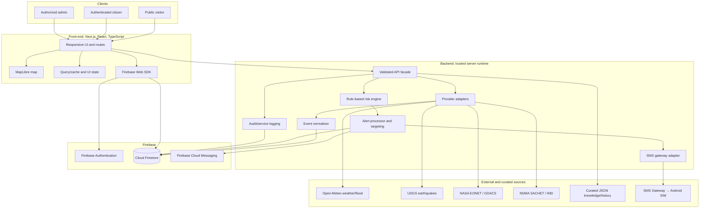
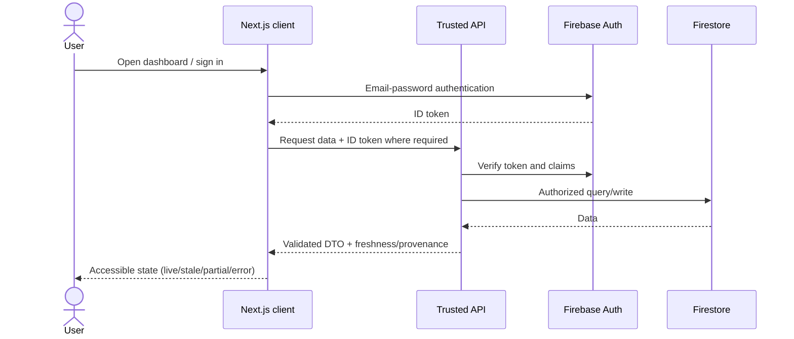
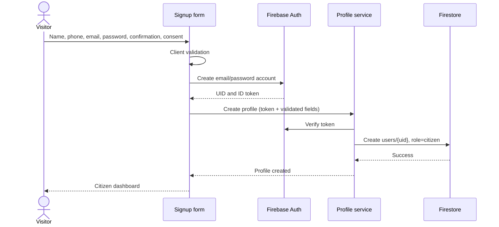
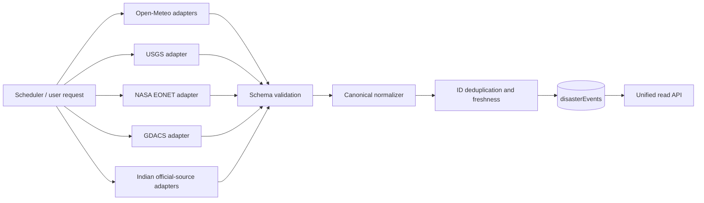
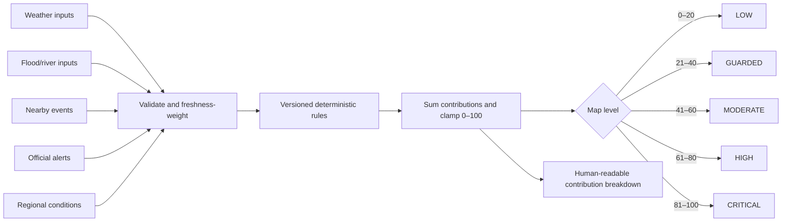
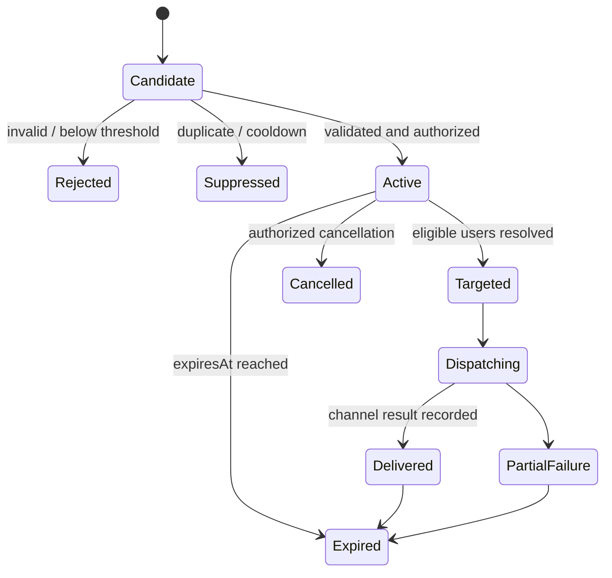
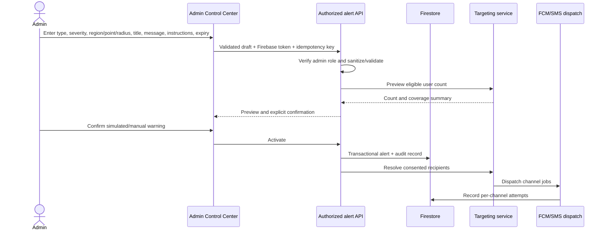
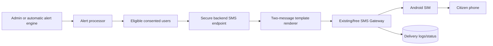

# ResQEarth Technical Architecture

**Descriptor:** ResQEarth — Smart Disaster Intelligence, Preparedness and Emergency Warning Platform  
**Document status:** Development baseline  
**Scope:** Architecture only; this document does not constitute an implementation or an official warning system.

## 1. Document purpose

This document defines the technical architecture for ResQEarth, a responsive web-based Second-Year Engineering Environmental Science (ESE) project. It establishes component boundaries, data contracts, security expectations, failure behavior, and deployment independence before development begins. It is consistent with `PRD.md` and `MVP.md`.

## 2. Project overview

ResQEarth unifies environmental observations, official alerts, public disaster feeds, explainable calculated risk, preparedness knowledge, and emergency communication. It supports the lifecycle **mitigation → preparedness → early warning → response → recovery/awareness** for natural and man-made disasters.

Public visitors receive a location-aware dashboard, weather and environmental information, a MapLibre disaster map, active-event summaries, preparedness content, and verified government links. Authenticated citizens may save preferences, use geolocation, see nearby events and warnings, and receive consent-based browser/SMS notifications. Authorized administrators may review system health and create simulated/manual regional warnings.

ResQEarth must label provenance prominently:

- **OFFICIAL ALERT**: received from a verified authority/provider and retains its source attribution.
- **RESQEARTH CALCULATED RISK**: deterministic educational decision support, never represented as a government forecast or instruction.
- **MANUAL ADMIN WARNING**: created by an authorized ResQEarth administrator, clearly marked as such.

## 3. Architecture principles

1. **Safety before novelty:** provenance, timestamps, limitations, and emergency disclaimers are visible.
2. **Explainability:** every calculated risk exposes contributing factors and rules.
3. **Provider independence:** adapters isolate external API formats and outages.
4. **Progressive enhancement:** denial of location or notification permission does not block core use.
5. **Least privilege:** only trusted server code performs privileged writes or accesses secrets.
6. **Graceful degradation:** partial, stale, and cached data remain distinguishable and usable.
7. **Privacy by design:** collect only data needed for consented features; use coarse location where possible.
8. **Mobile first:** SMS deep links and warning content work at 360 px width.
9. **Accessible urgency:** severity is communicated through text, iconography, and structure—not color alone.
10. **Hosting portability:** deployment-specific details stay behind environment and service boundaries.

## 4. High-level architecture



### Frontend/backend/Firebase interaction



## 5. Canonical folder structure

```text
PROJECT_ROOT/
├── Resources/
│   ├── Images/
│   └── Documents/
│       ├── architecture.md
│       ├── PRD.md
│       └── MVP.md
├── Front-end/
└── Backend/
```

All future web code belongs in `Front-end/`; trusted services, provider adapters, alert processing, and SMS integration belong in `Backend/`. `Resources/Images/` holds approved source assets such as official logos only when usage is permitted. No alternate root folders such as `frontend`, `backend`, `docs`, or `assets` are canonical.

## 6. Frontend architecture

The recommended frontend stack is Next.js, React, TypeScript, Tailwind CSS, shadcn/ui, Framer Motion, Lucide React, React Hook Form, Zod, MapLibre GL JS, Recharts, and the Firebase Web SDK.

Logical layers:

- **Routes/layouts:** public, authenticated citizen, admin, legal, knowledge, and error surfaces.
- **Feature modules:** authentication, dashboard, weather, disasters, map, risk, alerts, notifications, admin, history, government resources, preferences.
- **UI system:** tokens and accessible primitives; motion must honor reduced-motion preferences.
- **Data client:** typed request functions, schema validation, normalized cache keys, freshness metadata.
- **Firebase client:** authentication state and FCM token lifecycle only; no privileged admin behavior.
- **Map module:** map initialization, data sources/layers, controls, filters, clustering, popups, and attribution.

The browser never stores service credentials. It treats all external and backend responses as untrusted, validates critical payloads, escapes output, and renders explicit loading/empty/partial/stale/failure states.

## 7. Backend architecture

The backend may use Firebase Functions or another lightweight TypeScript server runtime. Its contract is more important than its host. Responsibilities are:

- verify Firebase ID tokens and admin authorization;
- validate request payloads with shared Zod schemas;
- call provider adapters and normalize results;
- compute deterministic risk assessments;
- perform distance and targeting calculations;
- create/deduplicate/expire alerts;
- dispatch FCM and SMS through server-only credentials;
- record notification attempts and audit events;
- expose health/freshness summaries without leaking secrets.

Public read endpoints should be cacheable and rate limited. Mutation endpoints must require authentication, authorization, idempotency/deduplication controls, and audit records.

## 8. Firebase architecture

- **Firebase Authentication:** email and password for citizens and administrators. Phone is profile/contact data, not Firebase Phone Authentication in the MVP.
- **Cloud Firestore:** profiles, events, assessments, alerts, preferences, notification token metadata, delivery logs, and audit records.
- **Firebase Cloud Messaging:** consented browser notification delivery.
- **Security Rules:** deny by default; citizen-owned reads/writes are field-limited; public content is selectively readable; admin and server operations are role/claim checked.
- **Trusted runtime:** Firebase Admin SDK, if used, exists only in `Backend/` and is never bundled to the browser.

## 9. Authentication architecture



Account creation collects `name`, `phone`, `email`, `password`, and `confirmPassword`. Password values never enter Firestore. Profile creation is idempotent and defaults the role to `citizen`. Failure to create the profile after Auth creation must be recoverable on the next session.

## 10. Role and authorization architecture

Roles are exactly `citizen` and `admin`. Public signup can create only `citizen`. Administrators are provisioned through a trusted, audited process. Authorization is enforced at all three relevant layers:

1. UI route guards improve user experience.
2. Backend middleware verifies the Firebase token and server-trusted role/custom claim.
3. Firestore Security Rules prevent unauthorized direct access.

Hiding admin controls is never an authorization mechanism. Sensitive role changes and manual alert creation require fresh authorization where practical and always create audit records.

## 11. Firestore data model

Collection names are stable across all project documents.

| Path | Key fields | Access/notes |
|---|---|---|
| `users/{uid}` | `name`, `email`, `phone`, `role`, `createdAt`, `notificationConsent`, `smsConsent`, `lastKnownLocation` | Owner reads limited profile; server/admin controls role and sensitive fields. Location is optional, coarse/expiring where feasible. |
| `users/{uid}/preferences/default` | disaster types, radii, channel choices, location mode, cookie preferences | Owner read/write with field validation. This subcollection avoids a globally queryable preferences collection. |
| `users/{uid}/notificationTokens/{tokenId}` | token hash/reference, platform, created/updated/lastSeen, status | Owner registers through trusted endpoint; raw tokens tightly restricted. |
| `disasterEvents/{eventId}` | provider IDs, type, title, geometry, severity, source, sourceType, timestamps, status, raw-reference/freshness | Normalized canonical event; provider event ID supports idempotency. |
| `riskAssessments/{assessmentId}` | subject region/location cell, score, level, contributions, input event IDs, calculatedAt, expiresAt, modelVersion | Server write; explanations contain no unsupported certainty. |
| `alerts/{alertId}` | unified alert fields plus `dedupeKey`, target, provenance, timestamps | Active/expired/cancelled lifecycle; public/citizen visibility scoped by target. |
| `alerts/{alertId}/deliveryAttempts/{attemptId}` | user, channel, status, provider reference, attempt timestamps, safe error code | Server/admin only; avoids an unbounded alert document. |
| `smsDeliveryLogs/{logId}` | alert, user, message part (1/2), phone hash/masked phone, status, provider reference, timestamps | No message secrets; retention-limited. Separate top-level collection supports operational queries. |
| `auditLogs/{logId}` | actor, action, resource, timestamp, request/correlation ID, outcome, safe metadata | Append-only server writes; restricted reads. |
| `serviceStatus/{serviceId}` | provider health, last attempt/success, freshness, safe error summary | Public subset may be shown; secrets and raw errors excluded. |

The conceptual `userPreferences` and `notificationTokens` datasets are nested under each user to make ownership and rules clearer. `smsDeliveryLogs` remains top-level because admins require cross-alert operational queries. Required indexes are defined only after query patterns are finalized; collection-group queries must be explicitly secured.

## 12. Disaster API adapter architecture

Adapters implement a common interface conceptually containing `fetch`, `validate`, `normalize`, `health`, and `provenance`. Candidate adapters are Open-Meteo weather, Open-Meteo Flood/GloFAS, USGS Earthquake GeoJSON, NASA EONET, GDACS, NDMA SACHET, and IMD. Provider availability and legal/attribution requirements must be verified before implementation.



Provider errors are isolated. Aggregation returns successful sources plus a `sources` status list rather than failing the entire response.

## 13. Map/GIS architecture

MapLibre GL JS renders an OpenStreetMap-compatible basemap whose tile license and attribution are approved. The map consumes normalized GeoJSON from the application API, not provider-specific structures. Separate sources/layers represent events, official alert boundaries, manual warning radii, heatmaps, clusters, and user location.

Capabilities include pan, drag, zoom controls, wheel zoom, touch gestures, current-location positioning, event markers/popups, clustering, filters, optional heatmaps, and visible source attribution. Popups are keyboard reachable; essential warning information also appears outside the map in an accessible list. Coordinates use WGS84 (`longitude`, `latitude`) with explicit ordering.

## 14. Disaster event normalization

The canonical event contract includes:

```text
id, provider, providerEventId, disasterType, title, description,
severity, severityScale, source, sourceUrl, sourceType,
geometry, centroid, affectedRegions, occurredAt, updatedAt,
expiresAt, status, fetchedAt, freshness, instructions
```

`sourceType` is `official`, `public-feed`, or `curated`; calculated risks are not disaster events. Disaster types map to a controlled vocabulary covering flood, urban flood, cyclone, earthquake, tsunami, landslide, heat wave, cold wave, drought, lightning, wildfire, avalanche, severe storm, industrial accident, chemical leak, biological emergency, nuclear/radiological emergency, urban fire, building collapse, oil spill, transport accident, and major pollution incident. Unknown provider categories remain traceable and map to `other` until reviewed.

## 15. Geolocation architecture

Geolocation is requested contextually after explaining the benefit. With consent, the browser obtains approximate coordinates and sends only what is needed for the requested calculation. A user may choose a manual city/state/location instead. Denial, timeout, unavailable GPS, or unsupported browsers result in manual selection—not a blocked experience.

Persisted `lastKnownLocation` is optional and consented. It should include precision/source and `updatedAt`; retention and deletion controls apply. The UI must not suggest continuous tracking when none exists.

## 16. Risk-engine architecture

The MVP risk engine is deterministic and versioned. It consumes validated, time-bounded observations and returns a clamped integer score from 0–100, a level, contributions, limitations, input timestamps, and provenance.



Conceptual contributions are weather, flood/river, nearby disaster, official alert, and regional conditions. Exact weights are configurable and documented with `modelVersion`; missing inputs reduce confidence and are never silently treated as safe. An example result is `Flood Risk 76/100` with itemized additions. The display always says **RESQEARTH CALCULATED RISK** and includes calculation time and limitations.

## 17. Nearby-disaster detection

For point events, use the Haversine formula to calculate distance between the user's WGS84 coordinates and event centroid. For polygon/line events, use appropriate point-in-polygon or nearest-geometry logic when available; a centroid-only result is labeled approximate. Configurable default radii are 10, 25, 50, and 100 km, with future per-disaster overrides.

Inputs are validated for latitude/longitude ranges. Unknown event locations are shown without proximity claims. Backend targeting is authoritative for notifications; client calculations are display assistance only.

## 18. Alert architecture

The unified alert fields are:

```text
id, title, description, disasterType, severity, source, sourceType,
region, latitude, longitude, radiusKm, targetMode, instructions,
createdAt, expiresAt, createdBy, status, eventIds, dedupeKey
```

`sourceType` is `official`, `automatic`, or `manual-admin`. Status is `draft`, `active`, `expired`, `cancelled`, or `superseded`. Official source attribution is preserved; automatic alerts identify ResQEarth calculation rules.



Automatic creation evaluates: risk threshold exceeded, nearby severe event detected, or official alert covers the user's region. `dedupeKey` combines source/event/type/target/time window; transactional creation prevents repeats. Notification preferences, consent, alert expiration, event IDs, region matching, and already-notified users are checked before dispatch.

## 19. Firebase Cloud Messaging architecture

FCM permission is requested only after a user-facing explanation and an affirmative action. The application registers and refreshes tokens through a trusted endpoint, removes invalid tokens, supports foreground presentation and background service-worker messages, and navigates notification clicks only to allowlisted internal routes such as `/disasters/flood`.

Payloads contain no sensitive profile data. Delivery attempts are recorded without treating FCM acceptance as proof that a human saw the warning. Notification denial leaves in-site warnings active.

## 20. Admin warning architecture



Target modes are all users, state, city, region, or radius around a map point. The UI clearly marks college-demo/simulated warnings. Server-side matching, not client UI, determines recipients.

## 21. SMS gateway architecture



Message 1 contains warning, key precautions, provenance, and a mobile-safe disaster guide link. Message 2 contains validated emergency contacts and the project link. Both include alert identifiers/parts for correlation. Phone numbers and gateway credentials never appear in frontend bundles or logs; operational logs mask/hash numbers. The gateway adapter handles timeouts, retries with backoff, idempotency, rate limits, and failure status. Emergency numbers and message content require validation before production use.

## 22. Knowledge portal architecture

Routes `/disasters` and `/disasters/[slug]` use structured, reviewed content. Each disaster record supports overview, definition, causes, environmental factors, warning signs, human and environmental impacts, before/during/after guidance, emergency kit, prohibited actions, emergency numbers, government resources, useful links, and references. Slugs are allowlisted and SMS-safe. Content includes revision dates and sources and is rendered server-side or statically for speed and direct-link reliability.

## 23. Static and curated data architecture

The `/history` timeline uses a local structured JSON dataset for the MVP with date, name, location, type, cause, human impact, environmental impact, lessons, and sources. `/government-response` uses reviewed organization records for NDMA, NDRF, IMD, CWC, INCOIS, the Ministry of Home Affairs, Ministry of Earth Sciences, and other verified agencies. Logos are not fabricated; only approved official assets and usage-compliant source links are used.

About, privacy, terms, cookies, knowledge, emergency contacts, and historical data have source/review metadata. Content changes are reviewable in version control.

## 24. Security architecture

- Firebase ID tokens are verified server-side; authorization uses trusted roles/claims.
- Firestore rules deny by default and enforce ownership, field constraints, and admin-only writes.
- Zod validates client forms and all backend boundaries; server validation is authoritative.
- Secrets use hosting environment/secret storage and never enter Git, browser JavaScript, URLs, or logs.
- Privileged Firebase, FCM, alert, role, and SMS operations are server-side.
- React escaping, safe rendering, a strict content policy, URL allowlists, and no unsanitized HTML mitigate XSS.
- CSRF protections apply where cookie-authenticated endpoints exist; token-based calls verify origin as appropriate.
- Rate limiting applies to authentication-sensitive, provider proxy, alert-preview, and notification endpoints.
- Duplicate-alert and idempotency controls prevent repeated dispatch.
- Errors return safe codes and correlation IDs, not provider secrets or stack traces.
- Audit logs cover admin access, alert lifecycle, role changes, dispatches, and security-relevant failures.
- Dependencies, licenses, and advisories are reviewed; access follows least privilege.

## 25. Privacy architecture

Collect name, email, phone, approximate/selected location, Firebase identifiers, notification tokens, SMS/notification consent, and essential preferences only as needed. Explain purpose at collection. Separate consent by channel, allow withdrawal, and define deletion/retention behavior before production. Do not store precise continuous location history in the MVP.

Cookie choices are `Accept All`, `Essential Only`, and `Manage Preferences`. Essential authentication/session and preference storage is clearly described. Analytics is off unless later added with disclosure and consent. The project must not claim compliance with a law until qualified review confirms it.

## 26. API error and fallback architecture

| State | Required behavior |
|---|---|
| Loading | Skeleton/progress plus non-blocking navigation. |
| Empty | Explain that no matching data was found; do not imply safety. |
| Partial data | Render successful sources and list unavailable sources. |
| Stale data | Show `Last successfully updated`, stale badge, and retry option. |
| API failure | Isolate provider, use cache if valid, show safe error. |
| Location denied | Offer manual location selection. |
| No network | Show cached/static safety content and connection state. |
| Notification denied | Retain in-site alerts and preference instructions. |
| SMS failure | Record failure; do not claim delivery; preserve other channels. |
| Unknown disaster location | Show event without distance/radius assertion. |

Circuit breakers and bounded timeouts protect aggregation. No single provider outage crashes the homepage or map.

## 27. Caching strategy

- Static knowledge/legal/history data: build/static cache with content revision metadata.
- Weather: short TTL appropriate to provider rules; location-rounded cache keys.
- Disaster events/official alerts: provider-sensitive TTL, conditional requests where supported, last-success snapshot.
- Basemap/tiles: obey provider caching and attribution terms; no unauthorized offline cache.
- Risk assessment: cache only for matching location cell, input versions, and short expiry.
- Browser cache: avoid sensitive responses; service worker scope initially limited to FCM needs.

Every dynamic response carries `fetchedAt`, `lastSuccessfulUpdate`, and source status where relevant. Cache never strips provenance or makes stale data appear live.

## 28. Responsive architecture

Layouts must be verified at 360×800, 390×844, 430×932, 768×1024, 1366×768, and 1920×1080. Mobile uses stacked cards, collapsible filters, bottom-safe controls, touch targets, and a map/list switch where space is constrained. Dialogs become sheets/full-screen panels when necessary. Admin tables gain card or horizontal-scroll alternatives. Critical warning actions remain above the fold without obscuring map attribution.

## 29. Accessibility

Use semantic HTML, logical headings, landmarks, labels, error associations, keyboard navigation, visible focus, readable contrast, and ARIA only where native semantics are insufficient. Warnings include severity text and icons/patterns as well as color. Live announcements are restrained and screen-reader compatible. Maps have accessible names, keyboard controls, and a synchronized non-map event list. Charts provide text summaries. Animation respects `prefers-reduced-motion`.

## 30. Deployment architecture

GitHub is the version-control source. Production targets Antideploy, but the frontend and backend use standard build commands, environment contracts, and provider-neutral URLs so another host can replace it. Separate development/preview/production Firebase projects and credentials are required. Deployment gates include tests, build, security-rule checks, environment validation, and smoke tests. Hosting capabilities for Next.js server features, FCM service workers, HTTPS, headers, server secrets, and backend runtime must be confirmed before implementation.

## 31. Logging and auditing

Structured logs use timestamps, severity, component, correlation ID, provider, safe outcome, and latency. They exclude passwords, tokens, raw phone numbers, precise coordinates where unnecessary, and message secrets. Admin mutations, targeting previews, alert activation/cancellation, notification attempts, role changes, and security-rule denials have auditable records. Retention and access controls are documented before production.

## 32. Testing architecture

- **Unit:** validators, normalization, severity mapping, Haversine calculations, risk contributions, dedupe keys, template rendering.
- **Contract:** recorded/synthetic provider fixtures and schema-change detection.
- **Integration:** Auth/profile creation, Firestore Rules, alert transaction, FCM token lifecycle, SMS adapter sandbox.
- **End-to-end:** public and citizen journeys, admin manual warning, denied permissions, provider outage, mobile SMS deep link.
- **Accessibility:** automated scans plus keyboard and screen-reader checks.
- **Responsive/visual:** named viewport matrix, map/dialog/admin/knowledge pages.
- **Security:** authorization bypass, input/XSS, secret scanning, rate limit, cross-user access, rules emulator.
- **Resilience:** partial sources, stale cache, retry/idempotency, SMS/FCM failure.

Tests use fake/sandbox recipients and never dispatch an unlabeled real emergency warning.

## 33. Scaling considerations

Partition work by provider and alert; use batched/queued notification jobs rather than synchronous fan-out. Query users through coarse indexed location cells/region codes before exact radius checks. Keep Firestore documents bounded, move attempts to subcollections/operational collections, and apply retention. Cache high-read public data. Observe quotas and provider limits. Scaling design does not justify premature infrastructure for the college MVP.

## 34. Known limitations

- Provider coverage, latency, availability, and severity definitions vary.
- Calculated risk is educational and cannot predict disasters or replace authorities.
- Browser geolocation may be inaccurate or unavailable; saved locations become stale.
- SMS/FCM delivery is not guaranteed and receipt is not proof of user awareness.
- Centroid distance can misrepresent large-area events.
- Curated history and knowledge content may be incomplete and requires source review.
- Government endpoints, reuse terms, emergency numbers, logo rights, and Antideploy capabilities require verification.
- The MVP is not certified for life-safety operations.

## 35. Future extensibility

Adapters allow additional providers and hazard types. Versioned rules permit improved scoring without rewriting presentation. Targeting can evolve to polygons/geohashes. Future work may include multilingual content, offline PWA features, native applications, volunteer/resource coordination, verified authority integrations, advanced geofencing, and research-backed forecasting/ML. AI output must never bypass provenance, validation, or human/authority review.

## 36. Architecture decision summary

| Decision | Choice | Reason |
|---|---|---|
| Web stack | Next.js/React/TypeScript with Tailwind/shadcn | Responsive, typed, component-based development. |
| Map | MapLibre GL JS with compliant OSM-compatible source | Open GIS rendering and multi-layer support. |
| Identity | Firebase email/password | Meets MVP need; phone remains alert contact. |
| Data | Firestore with owner-scoped subcollections | Realtime-friendly and security-rule compatible. |
| Backend | Host-neutral trusted TypeScript service/Functions | Keeps credentials and privileged work server-side. |
| Providers | Replaceable adapters + canonical events | Prevents provider formats/outages from coupling the UI. |
| Risk | Deterministic, explainable, versioned rules | Appropriate, auditable MVP behavior. |
| Alerts | Unified model with provenance and lifecycle | Supports official, automatic, and manual-admin sources. |
| Proximity | Backend-authoritative Haversine, later geometry support | Simple MVP with a clear upgrade path. |
| Notifications | In-site + consented FCM + two-part SMS | Multi-channel demonstration with explicit limitations. |
| Deployment | GitHub → Antideploy behind environment boundaries | Target host without architectural lock-in. |
| Content | Structured reviewed local data for knowledge/history | Reliable mobile deep links and auditable sources. |

---

ResQEarth supplements verified official information. During a real emergency, users must follow local authorities and established emergency services; the platform is not a substitute for them.
